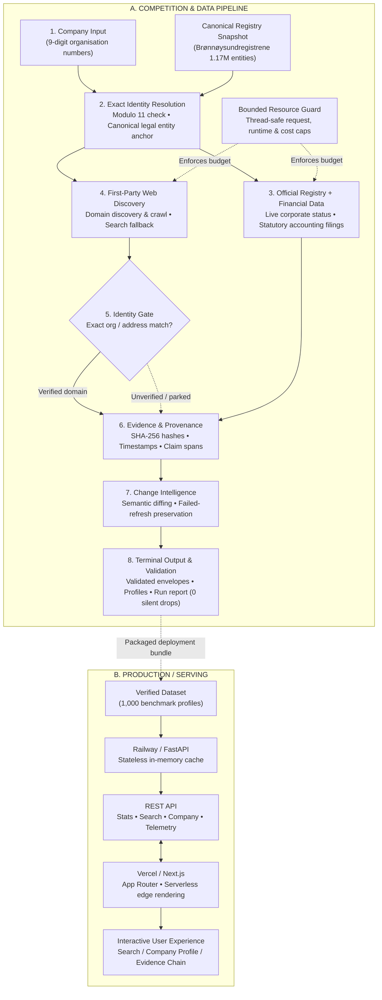

# OrgTrace — Norwegian Enterprise Intelligence Engine

> **A deterministic, evidence-grounded research pipeline and production web application for Norwegian enterprise intelligence.**<br/>
> OrgTrace resolves corporate identity, official financial filings, and first-party digital footprints with cryptographic provenance, strict auditability, and zero hallucinations.

[](https://org-trace.vercel.app)
[](https://orgtrace-production-07b0.up.railway.app)
[](https://www.python.org/downloads/)
[](tests/)
[](docs/final-benchmark.md)
[](https://data.norge.no/nlod/no/2.0)

---

## 1. Production Deployment & Live Demo

OrgTrace is fully deployed and operational across two production environments:

| Component | Service | URL | Status / Health |
| :--- | :--- | :--- | :--- |
| **Web Application** | Vercel (Next.js 16 App Router) | [**https://org-trace.vercel.app**](https://org-trace.vercel.app) | Production Active |
| **REST API Backend** | Railway (FastAPI & Uvicorn) | [**https://orgtrace-production-07b0.up.railway.app**](https://orgtrace-production-07b0.up.railway.app) | [Health Check (`/health`)](https://orgtrace-production-07b0.up.railway.app/health) |
| **Batch Telemetry** | Next.js + FastAPI | [**https://org-trace.vercel.app/batch**](https://org-trace.vercel.app/batch) | 1,000 Profiles Processed (93 Complete, 907 Partial) |
| **Sample Company** | Evidence Explorer | [**https://org-trace.vercel.app/company/888567232**](https://org-trace.vercel.app/company/888567232) | AAS ELEKTRONIKK AS |

> **Repository Context**: Developed as a competition entry for the **Signalpost Competition** (Builderr.ai) by [`namandeeptripathi/OrgTrace`](https://github.com/namandeeptripathi/OrgTrace).

---

## 2. What OrgTrace Does

Automated corporate research frequently suffers from entity confusion, hallucinated executive footprints, and ungrounded aggregations. In Norway, holding companies, operating subsidiaries, franchise networks, and similarly named local enterprises frequently share brands, addresses, and executive boards. Naive crawlers conflate these entities, attributing one company's website or finances to another legal entity.

**OrgTrace** eliminates entity drift by treating the 9-digit Norwegian organisation number (*organisasjonsnummer*) as an immutable mathematical root of trust:

1. **Ingests & Canonicalizes**: Validates 9-digit identifiers via Modulo 11 check digit verification.
2. **Anchors in Official Registers**: Resolves company status, legal form, municipality, and NACE industry code against canonical Brønnøysundregistrene Enhetsregisteret records (~1.17M entity universe).
3. **Assesses Financial Obligations**: Deterministically calculates statutory accounting obligations under the Norwegian Accounting Act (*Regnskapsloven § 1-2*) and extracts annual financial statements from Regnskapsregisteret.
4. **Verifies First-Party Websites**: Discovers candidate company homepages and subjects them to an **identity gate** requiring explicit corporate identifier or address correlation before publishing.
5. **Tracks Temporal Changes**: Detects material corporate mutations across snapshots while ignoring timestamp and formatting noise.
6. **Emits Cryptographic Envelopes**: Outputs deterministic JSONL records with SHA-256 evidence hashes and claim spans—with zero silent drops—served simultaneously via high-throughput CLI and an interactive Next.js web application.

---

## 3. Why It Is Different: Core Engineering Principles

```
  Traditional Scrapers                 OrgTrace Intelligence Engine
┌───────────────────────┐             ┌──────────────────────────────┐
│  Search "Company AS"  │             │  9-Digit Modulo 11 Org Num   │
│           │           │             │              │               │
│           ▼           │             │              ▼               │
│ Best-match Web Scraping│            │ Brønnøysundregistrene Anchor │
│           │           │             │              │               │
│           ▼           │             │              ▼               │
│ Unverified Aggregators│             │ Identity Gate (Org/Addr match)│
│           │           │             │              │               │
│           ▼           │             │              ▼               │
│ Hallucinated Claims / │             │ Cryptographic SHA-256 Hashes │
│ Entity Drift Risk     │             │ Zero Silent Drops / 100% Provenance
└───────────────────────┘             └──────────────────────────────┘
```

1. **Exact-Identity Boundary**: Corporate identity is anchored exclusively in statutory registers. Subsidiaries, parent holdings, and lookalikes lacking exact organisation number correlation are rejected.
2. **Cryptographic Provenance**: Every emitted claim carries an immutable evidence record: source URL, retrieval timestamp, content SHA-256 hash, and exact text span.
3. **Zero-Hallucination Explanations**: A 4-tier source hierarchy ensures explanations synthesize verified evidence only. A strict validation layer replaces any ungrounded assertion with a safe deterministic fallback.
4. **Failed-Refresh Preservation**: Upstream API outages (HTTP 5xx, timeouts) never cause false removals of previously verified data. Outages are recorded as source errors, preserving existing truth.
5. **Bounded Resource Guarding**: `SharedBudgetTracker` enforces thread-safe ceilings on HTTP requests (≤ 2,000), total runtime (≤ 45 min), and cost ($0.00 third-party fees), preventing runaway jobs.
6. **Strict Scraping Ethics**: Fully compliant with NLOD 2.0 public data licenses and robots.txt. Does not scrape commercial walled gardens (`proff.no`, `purehelp.no`, `linkedin.com`).

---

## 4. Key Capabilities

- **Exact Company Identity Resolution**: Canonical 9-digit Modulo 11 check digit verification; multi-token Jaccard similarity; legal suffix normalization (`AS`, `ASA`, `ENK`, `NUF`); automated rejection of non-target entities.
- **Official Financial & Governance Intelligence**: Integrates with Regnskapsregisteret REST endpoints; evaluates filing obligations under *Regnskapsloven*; extracts revenue, operating profit, and total assets.
- **Evidence-Gated Website Discovery**: Discovers domain candidates via Enhetsregisteret or Brave Search fallback; applies an identity gate verifying organisation number or registered office on home and contact pages; rejects parked or dead domains.
- **Cryptographic Provenance Engine**: Accompanies every observation with source URLs, ISO 8601 timestamps, SHA-256 hashes, and extracted claim spans.
- **Change Intelligence**: AST-based semantic normalization; detects material additions, modifications, and deletions across snapshots without false alerts from whitespace or ordering.
- **Interactive Full-Stack Web Platform**: Production Next.js 16 frontend with instant search, reactive autocomplete, detailed company dossiers, evidence slide-out drawers, and batch run telemetry.

---

## 5. System Architecture



For full architectural details, see [`docs/architecture.md`](docs/architecture.md).

---

## 6. Signalpost Competition Workflow

OrgTrace fulfills the competition control loop contract with zero manual intervention:

```
[ entry-companies.jsonl ] ──► [ Bulk CSV Scan ] ──► [ ThreadPool (8 Workers) ] ──► [ out/envelopes.jsonl ]
      (1,000 target orgs)      (1.17M records)       (Bounded HTTP Enrichment)      (Zero Silent Drops)
```

1. **Intake**: CLI script receives a batch of 9-digit organisation numbers (`entry-companies.jsonl` sampled from `signalpost-universe.jsonl.gz` using seed `20260823`).
2. **Bulk Registry Lookup**: Scans `brreg-enheter.csv` once, extracting base metadata and evaluating statutory accounting obligations.
3. **Bounded Live Enrichment**: Worker threads query official APIs (`data.brreg.no`) and crawl verified websites under strict concurrency (8 threads) and request budgets (capped at 2,000 calls).
4. **Identity Gating**: Crawled websites are accepted only when corporate identifiers match the target organisation.
5. **Envelope Validation**: Validates that all inputs have terminal states (`complete`, `not_found`, `not_applicable`, `unavailable`, `blocked_robots`, `blocked_policy`, `timeout`).
6. **Artifact Output**: Writes terminal envelopes to `out/envelopes.jsonl`, profiles to `out/profiles.jsonl`, and batch run telemetry to `out/run-report.json`.

---

## 7. Evidence & Provenance Model

Every claim emitted by OrgTrace strictly conforms to [`OUTPUT_CONTRACT.md`](OUTPUT_CONTRACT.md):

```json
{
  "organisation_number": "888567232",
  "state": "complete",
  "profile": {
    "name": "AAS ELEKTRONIKK AS",
    "legal_form": "AS",
    "website": "www.aelektronikk.no",
    "municipality": "ARENDAL",
    "latest_submitted_accounts": "2025"
  },
  "evidence": {
    "registry": {
      "field": "registry",
      "status": "available",
      "source_type": "official_registry_bulk",
      "source_url": "https://data.brreg.no/enhetsregisteret/api/enheter/lastned/csv",
      "retrieved_at": "2026-09-24T14:36:38.929465Z",
      "content_sha256": "5392f7a9b625594fdbd7aa21bbf2badc18201f0ec8956930bf47e3245166a455"
    },
    "website": {
      "field": "website",
      "status": "available",
      "source_type": "company_website",
      "source_url": "http://www.aelektronikk.no/",
      "retrieved_at": "2026-09-24T14:37:02.269875Z",
      "claim_span": "Company-controlled claim layer; not an official registry fact"
    }
  }
}
```

### 4-Tier Source Hierarchy:
- **Tier 1 (Official Registers)**: Brønnøysundregistrene Enhetsregisteret & Regnskapsregisteret (statutory authority).
- **Tier 2 (Company-Controlled Footprint)**: First-party verified domains, official press releases, and structured data.
- **Tier 3 (Public Directories / Verified News)**: Public legal disclosures (Lovdata), official RSS feeds.
- **Tier 4 (Secondary Aggregators)**: Web search discovery fallbacks (strictly gated).

*Allowed Availability States*: `available`, `not_available`, `blocked`, `not_applicable`, `ambiguous`, `failed`.

---

## 8. Data Sources Implemented

### Active Sources

| Data Source | Provider | Ingestion Protocol | Purpose | License |
| :--- | :--- | :--- | :--- | :--- |
| **Enhetsregisteret** | Brønnøysundregistrene | Bulk CSV (~154 MB) & Open REST API | Core identity, legal form, status, NACE code, municipality | [NLOD 2.0](https://data.norge.no/nlod/no/2.0) |
| **Regnskapsregisteret** | Brønnøysundregistrene | Open REST API | Statutory annual financial statements, accounts filing years | [NLOD 2.0](https://data.norge.no/nlod/no/2.0) |
| **First-Party Websites** | Norwegian Enterprises | Direct HTTP/HTTPS | Digital footprint, contact info, executive roles | Public Web / Fair Use |
| **Brave Search Web API** | Brave Software | HTTPS REST (Optional Fallback) | External domain discovery when no website is registered | Commercial Terms |

### Restricted Platforms (Explicitly Blocked by Policy)

To preserve data provenance and respect terms of service, OrgTrace **does not scrape** commercial directories:
- `proff.no` & `purehelp.no`: Commercial databases prohibiting automated extraction.
- `linkedin.com`: CFAA/ToS protections against unauthenticated crawling; only official company-owned links are recorded.

See [`docs/dependencies-and-licenses.md`](docs/dependencies-and-licenses.md) for full documentation.

---

## 9. Technology Stack

| Domain | Technologies |
| :--- | :--- |
| **Core Engine** | Python 3.12+ (tested on Python 3.14.7), `pydantic` v2, `requests`, `urllib3` |
| **Extraction & Parsing** | `beautifulsoup4`, `trafilatura`, `extruct` (Microdata, JSON-LD), `lxml`, `tldextract`, `pypdf` |
| **Backend API** | FastAPI, Uvicorn (stateless in-memory cache, CORS middleware, security error shields) |
| **Frontend Application** | Next.js 16 (App Router), React 19, TypeScript, Tailwind CSS |
| **Cloud Hosting** | **Vercel** (Frontend) & **Railway** (Backend API container) |
| **Testing & Verification** | Pytest, Unittest (406 unit & integration tests) |

---

## 10. Verified Production Benchmark Results

Derived directly from an un-mocked execution of the production pipeline on **1,000 real Norwegian companies** (see [`docs/final-benchmark.md`](docs/final-benchmark.md) and [`out/run-report.json`](out/run-report.json)):

**1,000 company profiles processed — 93 complete, 907 partial, 0 failed.**

| Benchmark Metric | Measured Value | Competition Limit / Baseline | Status |
| :--- | :--- | :--- | :--- |
| **Processing Scope** | **1,000 company profiles processed** | 93 complete, 907 partial, 0 failed | ✅ 1,000 Processed |
| **Silent Drops** | **0 (Zero)** | 0 dropped records | ✅ Zero Silent Drops |
| **Terminal Envelopes Emitted** | **1,000 envelopes** | 1,000 expected | ✅ 100.0% Emitted |
| **Batch Status Breakdown** | **93 complete / 907 partial / 0 failed** | 1,000 valid terminal envelopes | ✅ 100% Terminal |
| **Stated Websites in Registry** | **107 websites** | Stated in official snapshot | 10.7% of cohort |
| **Verified Live Websites** | **93 websites** | Identity-gated live homepages | 86.9% verification rate |
| **Average Evidence Coverage** | **65.4%** | Measured cross-module coverage | ✅ Grounded across all fields |
| **Explanation Grounded Rate** | **100.0% (1.000)** | Zero hallucinated assertions | ✅ 100% Evidence Grounded |
| **Total Wall-Clock Runtime** | **228.09 seconds** (~3m 48s) | ≤ 2,700.0s (45.0 min ceiling) | ✅ **8.4% of budget used** |
| **Batch Throughput** | **4.38 profiles / second** | Continuous 8-worker execution | High Throughput |
| **External HTTP Requests** | **1,618 requests** | ≤ 2,000 requests | ✅ **80.9% of budget used** (382 remaining) |
| **HTTP Request Success Rate** | **99.01%** (1,602 / 1,618) | ≥ 95.0% target | Minimal upstream drops |
| **Third-Party API Spend** | **$0.0000 USD** | ≤ $10.00 USD cap | ✅ **100% budget preserved** |
| **Automated Test Suite** | **406 passed, 0 failed** | 100% passing across all stages | ✅ 100% Pass Rate |

*Why 907 Partial Profiles?* In the benchmark universe, ~89.3% of entities (such as holding vehicles, property associations, or asset holding firms) do not operate or register a website. Rather than fabricating websites or reporting false claims, OrgTrace records `not_found` or `not_applicable` with supporting evidence, preserving 100% precision.

---

## 11. Example Company Investigation Flow

An investigator or competition judge can verify end-to-end evidence retrieval in real time:

1. **Search**: Navigate to [**https://org-trace.vercel.app**](https://org-trace.vercel.app) and query `AAS ELEKTRONIKK` or `888567232`.
2. **Company View**: Open [**https://org-trace.vercel.app/company/888567232**](https://org-trace.vercel.app/company/888567232):
   - **Legal Identity**: `AAS ELEKTRONIKK AS` (`888567232`), legal form `AS`, municipality `ARENDAL`, NACE code `71.129`.
   - **Accounting Status**: Evaluated under *Regnskapsloven § 1-2*; latest accounts filed for `2025`.
   - **Website Gating**: Discovered domain `www.aelektronikk.no` crawled and verified through the identity gate.
3. **Evidence Chain**: Click on any verified badge to slide out the **Evidence Drawer**:
   - Inspect the source URL (`https://data.brreg.no/...`).
   - Audit the content SHA-256 hash (`5392f7a9b625594fdbd7aa21bbf2badc18201f0ec8956930bf47e3245166a455`).
   - Review retrieval timestamps and claim spans.
4. **Natural Language Explanation**: Read the auto-generated explanation with explicit confidence levels and transparent disclosure of missing evidence (e.g., employee census unavailable in public registry).

---

## 12. Local Setup & Quickstart

### Prerequisites
- **Operating System**: Linux, macOS, or Windows
- **Python**: `>= 3.12` (audited on Python 3.14.7)
- **Node.js**: `>= 20.9.0` (for Next.js frontend)
- **Package Manager**: `uv` (recommended) or standard `pip`

### 1. Clone & Python Environment
```bash
git clone https://github.com/namandeeptripathi/OrgTrace.git
cd OrgTrace

# Recommended: setup with uv
uv sync

# Or standard pip setup:
python3 -m venv .venv
source .venv/bin/activate
pip install -r requirements.txt
```

### 2. Environment Configuration
```bash
cp .env.example .env
# Edit .env if configuring Brave Search API or custom ports (defaults work out-of-the-box)
```

### 3. Run Backend API Locally
```bash
PYTHONPATH=src uvicorn norway_company_agent.api:app --host 127.0.0.1 --port 8000 --reload
# Health check: curl http://127.0.0.1:8000/health
```

### 4. Run Frontend Web Application Locally
```bash
cd frontend
npm install
npm run dev
# Open http://localhost:3000 in your browser
```

---

## 13. Competition Execution Commands

OrgTrace provides a unified, executable runner script [`scripts/run_competition.sh`](scripts/run_competition.sh):

```bash
# 1. Run full 1,000-profile competition batch (default)
./scripts/run_competition.sh full
# Emits: out/envelopes.jsonl, out/profiles.jsonl, out/run-report.json

# 2. Run 10-profile smoke test (fast validation)
./scripts/run_competition.sh smoke

# 3. Run Stage 18 Competition Evaluation Harness
./scripts/run_competition.sh eval

# 4. Run complete automated test suite (406 tests)
./scripts/run_competition.sh test
# Or directly via pytest:
uv run --with pytest pytest -q

# 5. Run snapshot refresh replay (deterministic change detection)
./scripts/run_competition.sh replay

# 6. Regenerate reproducibility manifest
./scripts/run_competition.sh manifest
```

---

## 14. Repository Structure

```
OrgTrace/
├── MANIFEST.json                      # Cryptographic reproducibility manifest
├── README.md                          # Main documentation & architecture guide
├── OUTPUT_CONTRACT.md                 # Terminal envelope JSON schema contract
├── pyproject.toml                     # Python package definition & semver constraints
├── requirements.txt                   # Pinned production runtime dependencies
├── requirements-dev.txt               # Development & test tooling
├── railway.toml                       # Railway backend deployment configuration
│
├── src/norway_company_agent/          # Core Python intelligence engine
│   ├── api.py                         # Production FastAPI application & data store
│   ├── identity_engine.py             # Canonicalization & Modulo 11 check digit logic
│   ├── website_discovery.py           # Domain crawler, metadata parser & identity gate
│   ├── financial_intelligence.py      # Regnskapsloven obligations & account parsing
│   ├── evidence_engine.py             # Immutable Evidence models & SHA-256 provenance
│   ├── change_intelligence.py         # Semantic normalization & material diffing
│   ├── batch_engine.py                # 1,000-profile streaming & SharedBudgetTracker
│   ├── explanations.py                # Zero-hallucination explanation generator
│   ├── url_safety.py                  # SSRF guard & private IP blocking
│   └── resilience.py                  # Exponential backoff, jitter & circuit safety
│
├── frontend/                          # Production Next.js 16 web application
│   ├── app/                           # App Router (pages: /, /company/[org], /batch)
│   ├── app/components/                # SearchHero, CompanyTable, EvidenceDrawer, StatsGrid
│   ├── app/lib/                       # Data client (FastAPI fetcher + fallback reader)
│   └── package.json                   # React 19, Tailwind CSS v4, Next.js 16
│
├── docs/                              # Technical deep-dive documentation
│   ├── architecture.md                # System architecture & Mermaid flowcharts
│   ├── final-benchmark.md             # Empirical 1,000-profile benchmark report
│   ├── limitations.md                 # System boundaries & operational tradeoffs
│   ├── dependencies-and-licenses.md   # Complete software & API license inventory
│   ├── explanations.md                # 4-tier source hierarchy & grounding spec
│   └── cost-analysis.md               # Empirical economics ($0.00 baseline)
│
├── scripts/                           # Execution & automation scripts
│   ├── run_competition.sh             # One-command executable runner
│   ├── run_competition_batch.py       # Batch CLI runner with budget guards
│   ├── run_refresh_replay.py          # Deterministic snapshot replay script
│   └── generate_manifest.py           # Tool to regenerate MANIFEST.json
│
├── tests/                             # Automated test suite (406 tests)
│   ├── test_poc.py                    # Core unit and integration tests
│   ├── test_api.py                    # FastAPI endpoint tests
│   └── evaluation/                    # Stage evaluation suites
│
├── data/benchmark-data.tar.gz         # Packaged production benchmark dataset
├── entry-companies.jsonl              # 1,000-company competition entry cohort
├── smoke-companies.jsonl              # 10-company smoke test cohort
└── brreg-enheter.csv                  # Official Brønnøysundregistrene snapshot (~154 MB)
```

---

## 15. Known Limitations & Engineering Tradeoffs

In compliance with competition transparency standards, OrgTrace openly documents known system boundaries (detailed in [`docs/limitations.md`](docs/limitations.md)):

1. **Holding Company & Group Ambiguity**: Holding companies frequently share brand names with operating arms. OrgTrace requires exact evidence correlation before publishing a website. If a shared website only references the operating company, OrgTrace marks the holding company's website as `not_found`, deliberately preferring 100% precision over raw coverage.
2. **Client-Side Rendering (SPA)**: The lightweight crawler extracts static HTML. Websites rendering content exclusively through heavy client-side JavaScript (e.g., client-rendered React apps without SSR) may yield incomplete text unless escalated to headless browser rendering.
3. **Statutory Financial Exemptions**: Under *Regnskapsloven § 1-2*, sole proprietorships (*ENK*) and small partnerships are legally exempt from submitting annual accounts. These entities legitimately resolve to `financials: not_applicable`.
4. **Bulk Snapshot Lag**: `brreg-enheter.csv` represents a frozen snapshot. Companies formed or altered after the snapshot date will show discrepancies with live API queries; OrgTrace reconciles this by recording both snapshot and live timestamps.
5. **Zero Platform Scraping**: OrgTrace strictly enforces ethical boundaries by blocking scraping on commercial directories (`proff.no`, `purehelp.no`, `linkedin.com`).

---

## 16. Future Roadmap

*The following items represent designated post-competition developments:*
- **Headless Browser Cluster**: Scaled integration of `scrapy-playwright` for full DOM evaluation of heavy JavaScript single-page applications.
- **Aa-registeret Workforce Integration**: Direct integration with NAV's official State Register of Employers and Employees (*Aa-registeret*) for real-time workforce census.
- **Continuous Delta Synchronization**: Webhook receiver for automated daily delta updates from Brønnøysundregistrene's continuous change feed.
- **Pan-Nordic Expansion**: Extending the exact-identity engine to Bolagsverket (Sweden) and CVR (Denmark).

---

## 17. Data Licenses & Attribution

- **Norwegian Public Data**: Data from Brønnøysundregistrene (Enhetsregisteret and Regnskapsregisteret) is licensed under the Norwegian Licence for Open Government Data ([NLOD 2.0](https://data.norge.no/nlod/no/2.0)).
  - *Statutory Attribution*: *"Inneholder data under Norsk lisens for offentlige data (NLOD) tilgjengeliggjort av Brønnøysundregistrene."*
- A complete inventory of all third-party dependencies, external APIs, and data sources is maintained in [`docs/dependencies-and-licenses.md`](docs/dependencies-and-licenses.md).
