# OrgTrace — System Architecture

This document provides a comprehensive technical reference for the architecture of **OrgTrace**, a deterministic, evidence-backed Norwegian enterprise intelligence and company research engine.

---

## 1. System Overview

OrgTrace is engineered to resolve, verify, and enrich Norwegian corporate profiles at scale (≥ 1,000 companies per batch) with mathematical provenance and strict reproducibility. The system enforces an exact-identity boundary: every claim is anchored in official Norwegian public records (Brønnøysundregistrene Enhetsregisteret) and verified first-party digital footprints.

### Core Architectural Principles:
1. **Deterministic Anchoring**: The 9-digit Norwegian organisation number (`organisasjonsnummer`) serves as the immutable root of trust.
2. **Provenance & Evidence First**: Every fact emitted in a company envelope is accompanied by an audit trail (source URL, retrieval timestamp, content SHA-256 hash, and exact claim span).
3. **Graceful Degradation & Bounded Execution**: All network operations respect strict timeouts, bounded retries with jitter, circuit-breaking, and thread-safe budgets.
4. **Snapshot Immutability & Change Intelligence**: Entity states are immutable; refreshes detect genuine semantic mutations while ignoring formatting, ordering, or timestamp noise.
5. **Zero Platform Scraping**: OrgTrace strictly complies with robots.txt, terms of service, and public data licenses (NLOD 2.0).

---

## 2. High-Level Architecture Diagram

```mermaid
flowchart TD
    subgraph Inputs ["Input Layer"]
        IN1["Organisation Number Batch<br/>(JSON, JSONL, TXT)"]
        IN2["BRREG Bulk Snapshot<br/>(brreg-enheter.csv)"]
        IN3["Signalpost Universe<br/>(signalpost-universe.jsonl.gz)"]
    end

    subgraph Core ["OrgTrace Core Engine Pipeline"]
        direction TB
        BE["Competition Batch Engine<br/>(batch_engine.py / batch.py)"]
        
        subgraph Identity ["1. Identity Resolution"]
            IE["Identity Engine<br/>(identity_engine.py)"]
            CAN["Canonicalize Org Number<br/>(9 digits, Luhn check)"]
            BULK["Bulk Registry Extraction<br/>(profiles_from_bulk)"]
        end

        subgraph Discovery ["2. Discovery & Verification"]
            WD["Website Discovery<br/>(website_discovery.py)"]
            BRAVE["Brave Search API<br/>(run_brave_discovery.py)"]
            GATE["Identity Gate & Domain Matcher<br/>(apply_website_identity_gate)"]
        end

        subgraph Extraction ["3. Extraction & Intelligence"]
            PE["Profile Extraction<br/>(profile_extraction.py)"]
            FI["Financial Intelligence<br/>(financial_intelligence.py)"]
            OFF["Official API Connectors<br/>(official.py: Regnskap, Roles, Locations)"]
        end

        subgraph EvidenceLayer ["4. Evidence & Change Intelligence"]
            EE["Evidence Engine<br/>(evidence_engine.py)"]
            CI["Change Intelligence<br/>(change_intelligence.py)"]
            SNAP["Snapshot Manager<br/>(snapshots.py)"]
        end

        subgraph Safety ["Cross-Cutting Safety & Resilience"]
            SSRF["URL Safety & SSRF Guard<br/>(url_safety.py)"]
            RES["Resilience & Retry Policy<br/>(resilience.py / http.py)"]
            LIC["Licensing & Attribution<br/>(licensing.py)"]
            OBS["Observability & Logging<br/>(logging_utils.py / observability.py)"]
        end
    end

    subgraph Outputs ["Terminal Output Contract"]
        ENV["Terminal Envelopes<br/>(out/envelopes.jsonl)"]
        PROF["Enriched Profiles<br/>(out/profiles.jsonl)"]
        REP["Execution Report<br/>(out/run-report.json)"]
        EVAL["Evaluation Benchmark<br/>(EvaluationHarness)"]
    end

    IN1 --> BE
    IN2 --> BULK
    IN3 --> BE
    BE --> CAN --> BULK --> IE
    IE --> WD
    WD -.->|Fallback if no reg site| BRAVE
    WD --> GATE
    GATE --> PE
    PE --> FI
    FI --> OFF
    OFF --> EE
    EE --> CI --> SNAP
    SNAP --> BE
    BE --> ENV
    BE --> PROF
    BE --> REP
    BE -.-> EVAL

    SSRF -.-> WD
    SSRF -.-> OFF
    RES -.-> OFF
    RES -.-> BRAVE
    LIC -.-> EE
    OBS -.-> BE
```

---

## 3. Major Modules & Component Details

### 3.1 Company Identity Resolution (`src/norway_company_agent/identity_engine.py`, `identity.py`)
- **Canonicalization**: Strips non-digits, validates 9-digit format, and applies Modulo 11 check digit verification.
- **Official Registry Anchoring**: Loads baseline corporate metadata (`name`, `legal_form`, `municipality`, `industry_code`, `registered_office`) from the local Brønnøysundregistrene snapshot.
- **Multi-Candidate Scoring**: Evaluates candidate entity matches across legal name exact matching, token overlap (Jaccard similarity), legal form stripping (e.g., `AS`, `ASA`, `ENK`, `NUF`), and geographical congruence.
- **Non-Target & False-Positive Rejection**: Automatically rejects parent companies, franchises, distinct legal subsidiaries, or similarly named entities lacking exact organisation number correlation.

### 3.2 Website & Domain Discovery (`src/norway_company_agent/website_discovery.py`, `website.py`)
- **First-Party Priority**: Uses the official website URL registered in Enhetsregisteret whenever available.
- **External Discovery Fallback**: If no website is registered, queries Brave Search API with deterministic search queries (`"{name}" {org_number} Norway`).
- **Identity Gate**: Crawls candidate homepages and contact pages looking for explicit corporate identifiers (org number, exact registered address, matching executive names). If no exact match is proven, the candidate is discarded and marked `not_found`, never publishing unverified domains.

### 3.3 Company Profile Extraction (`src/norway_company_agent/profile_extraction.py`)
- **Structured Data Harvesting**: Extracts Microdata, JSON-LD, and RDFa metadata from company homepages.
- **Executive Leadership & Contact Extraction**: Parses management roles, telephone numbers, postal addresses, and email endpoints.
- **Social Media Link Normalization**: Discovers and normalizes corporate social profiles (LinkedIn, YouTube, Facebook), ensuring company-owned domain attribution.

### 3.4 Financial Intelligence (`src/norway_company_agent/financial_intelligence.py`, `official.py`)
- **Accounting Obligation Assessment**: Evaluates corporate form (`AS`/`ASA` vs `ENK`/`ANS`) and size thresholds under the Norwegian Accounting Act (*Regnskapsloven*) to determine whether annual accounts are legally required.
- **Regnskapsregisteret Integration**: Connects to the official Regnskapsregisteret API to extract annual revenue, operating profit (*driftsresultat*), net profit (*årsresultat*), total assets, and currency (NOK).
- **Graceful Fallback**: For entities without public accounts (e.g., holding entities or small sole proprietorships), emits `not_applicable` or `not_found` rather than failing the envelope.

### 3.5 Evidence & Provenance Engine (`src/norway_company_agent/evidence_engine.py`, `evidence.py`)
- **Immutable Evidence Objects**: Every observed fact is encapsulated in an `Evidence` dataclass containing `field`, `status`, `source_type`, `source_url`, `retrieved_at`, `content_sha256`, and `claim_span`.
- **Allowed Statuses**: `available`, `not_found`, `not_applicable`, `not_fetched`, `source_error`, `blocked`.
- **Licensing & Attribution**: Enforces correct attribution metadata (e.g., NLOD 2.0 for Norwegian government data).

### 3.6 Change Intelligence & Snapshot Management (`src/norway_company_agent/change_intelligence.py`, `snapshots.py`, `refresh.py`)
- **Semantic Normalization**: Compares entity versions ignoring formatting, whitespace, dictionary key order, or timestamp noise.
- **Failed-Refresh Preservation**: If an upstream data provider experiences an outage (HTTP 5xx, timeout), existing verified claims are preserved. Outages are never interpreted as deletions or removals.
- **Audit Log**: Emits `MaterialChangeRecord` with `field_name`, `change_type` (`added`, `modified`, `removed`), `previous_value`, `current_value`, and supporting evidence IDs.

### 3.7 Strategy & Learning Harness (`src/norway_company_agent/strategy_harness.py`)
- **Challenger Evaluation**: Compares candidate extraction strategies against a frozen production baseline.
- **Precision-First Promotion**: A challenger strategy is promoted only if precision remains 100% and coverage increases without exceeding latency/cost budgets.
- **Configuration Fingerprinting**: Cryptographic SHA-256 fingerprinting of all configuration dictionaries to guarantee exact experiment reproducibility.

### 3.8 Competition Batch Engine (`src/norway_company_agent/batch_engine.py`, `batch.py`)
- **1,000+ Profile Streaming**: Uses generator-based chunked streaming (`iter_company_inputs`) to process arbitrarily large datasets without memory exhaustion.
- **Thread-Safe Budget Enforcement**: `SharedBudgetTracker` enforces atomic request budgets, cost caps, and runtime ceilings across worker threads.
- **Resumable Cache**: `ResultCache` stores completed company evaluations by deterministic cache keys (`cache-{sha256}`), enabling seamless resumption of interrupted batch runs.
- **Exact Terminal States**: Guarantees that every company envelope resolves to one of the valid terminal states: `complete`, `not_applicable`, `not_found`, `blocked_policy`, `blocked_robots`, `source_error`, `request_budget_exceeded`, `runtime_budget_exceeded`, or `cost_budget_exceeded`.

---

## 4. End-to-End Data Flow

1. **Batch Intake**: CLI script (`scripts/run_competition_batch.py` or `scripts/run_competition.sh`) receives a list of organisation numbers (`entry-companies.jsonl`).
2. **Bulk Registry Lookup**: Scans `brreg-enheter.csv` once, extracting base metadata and computing accounting obligations for all target companies.
3. **Enrichment Dispatch**: A thread pool distributes company profiles to enrichment workers.
4. **Live Official Enhetsregisteret & Regnskap**: Official APIs are queried for live status, roles, financial statements, and registered locations.
5. **Website Verification**: The registered or discovered domain is validated through the identity gate.
6. **Envelope Synthesis**: Claims, evidence items, operations telemetry, and change logs are assembled into a single JSON object per organisation.
7. **Validation Gate**: `validate_envelopes` verifies that all expected envelopes are present, unique, and terminal, with zero silent drops.
8. **Artifact Generation**: Writes `out/envelopes.jsonl`, `out/profiles.jsonl`, and `out/run-report.json`.

---

## 5. External Source Interaction & Safety Controls

| Channel | Target | Protocol | Safety & Policy Controls |
| :--- | :--- | :--- | :--- |
| **Bulk Registry** | `data.brreg.no` | Local CSV / HTTPS | Pre-downloaded snapshot, SHA-256 integrity check, NLOD 2.0 |
| **Official Enhetsregisteret API** | `data.brreg.no/enhetsregisteret/api` | HTTPS REST | Rate-limited, bounded retries (max 3), exponential backoff with jitter |
| **Regnskapsregisteret API** | `data.brreg.no/regnskapsregisteret/regnskap` | HTTPS REST | Rate-limited, bounded retries, 404 handled as `not_found` |
| **Search Discovery** | `api.search.brave.com` | HTTPS REST | Budget-tracked, API key authenticated, strict timeout (15s) |
| **First-Party Websites** | Company domains | HTTPS / HTTP | DNS SSRF validation, private IP blocking, robots.txt compliance, max 4096 char URL |
| **Restricted Databases** | `proff.no`, `purehelp.no` | N/A | **Strictly blocked by policy**; no scraping permitted |

---

## 6. Error and Fallback Handling Matrix

| Error Scenario | Detection Point | Handling / Fallback Mechanism | Resulting Terminal State |
| :--- | :--- | :--- | :--- |
| **Org Absent from Bulk CSV** | `profiles_from_bulk` | Stubs profile with `status: not_found`, notes missing in snapshot | `not_found` / `complete` |
| **Official API Rate Limit (429)** | `resilience.py` / `http.py` | Respects `Retry-After` header, backs off exponentially (cap 5s) | Retried up to 3 times; if exhausted: `source_error` |
| **Official API Server Error (5xx)** | `resilience.py` / `http.py` | Exponential backoff with random jitter | Retried up to 3 times; if exhausted: `source_error` |
| **Official API Client Error (400, 404)** | `resilience.py` / `http.py` | Fails immediately on attempt 1 without wasteful retries | `not_found` |
| **Website Timeout / Connection Drop** | `website.py` | Caught by `requests.RequestException`, logged with sanitized URL | `website: not_found` |
| **Website SSRF / Private IP** | `url_safety.py` | Blocked before socket connection (`PrivateNetworkAccessError`) | `website: blocked_policy` |
| **Robots.txt Disallow** | `website.py` | Detected via `urllib.robotparser` | `website: blocked_robots` |
| **Batch Request Budget Exhaustion** | `SharedBudgetTracker` | Atomic check rejects further network calls | `request_budget_exceeded` |
| **Batch Runtime Budget Exhaustion** | `SharedBudgetTracker` | Atomic check terminates pending tasks | `runtime_budget_exceeded` |
